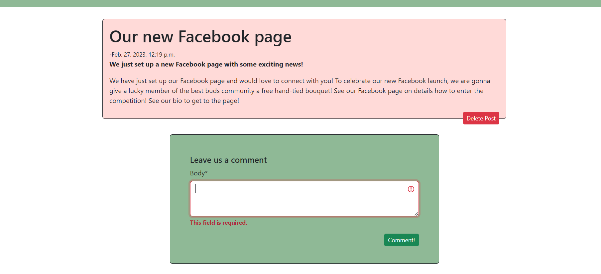
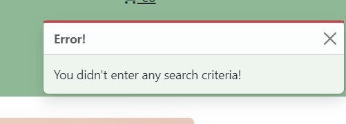

# **Best Buds**
Best buds is a fictional florist shop that specialises in bouquets and indoor plants. Located in Dublin, Ireland, Best Buds has a big focus on interacting with their consumer base. The website allows customers to make accounts that stores their information, which then also allows them to leave reviews on products. The website also has a blog section called 'Best Blogs' where they keep customers up to date on new products or even events the business might host. The blog allows customers to comment on posts and interact with each other, strenghtening their connection with their customers.

[Live Website](https://best-buds.herokuapp.com/)

# Table of Content

* [**Website Goals**](<#website-goals>)
    * [Target Audience](<#target-audience>)
    * [Brand Image](<#brand-image>)
* [**Project Management**](<#project-management>)
    *  [Trello](<#trello>)
* [**User Experience**](<#user-experience-ux>)
    *  [User Stories](<#user-stories>)
    *  [Wireframes](<#wireframes>)
    * [Design Choices](<#design-choices>)

# Website Goals
## Target Audience

* While also offering services to those who need it for weddings/funerals, or offering valentines and birthday gift ideas, Best buds core target audience is aimed towards floral enthusiasts. This is reinforced with the blog section, where their customer community can directly interact with business and other customers.

## Brand Image

* Best buds brand image is that they are a website built by flower enthusiasts, for flower enthusiasts. Every part of this website has been designed to show that above all else, the business cares for it's product as much as it's customers.

# Project Management

## Trello

* For this project I have used Trello to manage my projects progress. I have found trello monumentally helpful for monitoring my projects development and ensuring user stories were fulfilled in an efficient manner.

# User Experience (UX)

## User Stories

### Viewing And Navigation
* As a site user I want to quickly see what products and services are available.
* As a site user I want to be able to click on a product to find out more information about it.
* As a site user I want to have access to the website through any device.
* As a site user I want to have access to all pages through the navbar.
* As a site user I want to be able to sort products in different ways(A-Z/By Price).
* As a site user I want to be able to search the whole store for products.
* As a site user I want to be able to view contact information for the business.

### Registration And User Accounts
* As a customer I want to be able to be able to easily register an account.
* As a customer I want to be able to store my information with my profile to make the checkout process quicker.
* As a customer I want to be able to view my order history.
* As a customer I want to be able to review products I've purchased. 
* As a customer I want to be able to interact with blog posts.

### Products and Purchasing
* As a customer I want visual confirmation when adding or removing from my cart.
* As a customer I want to be able to see how much is currently in my cart on any page.
* As a customer I want to be able to receive email confirmation that I have made an order.
* As a customer I want my cart to clearly display each item's quantity with a cart summary.
* As a customer I want to see an order confirmation after checkout with all the orders details.

### Site Admin
* As a Site Admin I want to be able to create, read, update and delete products and blog posts. 
* As a Site Admin I want to be receive visual confirmation that I have created updated or deleted a product/post.
* As a Site Admin I want to be able to access the admin panel.
 

[Back to top](<#contents>)

## Wireframes

These wireframes were produced in [Figma](https://figma.com). I made frames for a full width display and then modeled for smaller screens once I had designed the full width diplay. The finished site varies slightly from the wireframes due to developments that occured during the creation process. I then scaled down the site and stacked content to fit it on smaller devices.

For smaller screens I created a second navbar that would replace the original. I did this as the original navbar looked very messy on smaller screens. In this navbar I replaced the business logo with an elegant font that is also used in the image carousel.

## Design Choices

### Logo

I used [Logo](https://logo.com/) to create the Best Buds Logo. I really like the simple, legible design of it and it immediately grabbed me when I saw it.

### Colour Scheme

For the colour scheme of this website, I wanted to use a palette with earthy tones that complimented its products. After searching through many colour palettes I decided on this one. I used [Coolors](https://coolors.co/) to browse through the colour schemes. I decided on this palette as I felt it really complimented the Best Buds logo.

### Typography
 
For the typography of the website I decided to stay with the original bootstrap font for most of the page as it is aesthetically pleasing and very legible. I used [Dancing Script](https://fonts.google.com/specimen/Dancing+Script?query=dancing+script) from google fonts for the small navbar title and for the carousel heading as I thought it looked elegant and fit the vibe of the website. 

# Features 

## Navbar

This website uses two navbars, one for large screens and another for smaller screens. Both navbars show the current carts total at all times. They both have links to all available pages on the website.

For smaller screens I created a second navbar that would replace the original. I did this as the original navbar looked very messy on smaller screens. In this navbar I replaced the business logo with an elegant font that is also used in the image carousel.

## Home Page

The first thing that appears under the navbar on the home screen is a carousel(on small screens a div) that welcomes users to the site and lets users know that delivery on orders over 30 euro is free. This has a link to the products page directly below this to entice customers to view their products.

The second slide on the carousel points towards the Indoor Plants section with a corresponding link.

This is followed by a Collections section, showing the different cateogies that the business specialises in.

The last piece of content on the home page is the About Us section, which documents the business and its morales.

## Products

The products page displays a list of all the products unless a user has searched or sorted for a certain type of product. The product card host basic information on each product such as a products image, name, price and what type of product it is.
There is a dropdown button at the top of the page, giving users an option to sort the way products are displayed in a variety of different ways.
If the user is logged in as an admin, small links appear on each card allowing them to edit or delete products.

## Product details

This page displays all the information available about a product from the image and price to the description. The user can add the product to their cart from here aswell.

If the user adds an item to their cart, they receive a toast notification to confirm it has been added with a summary on the item they have added, as well as their carts current total and a link to view their cart.

Below the product details section is a review section, where logged in users can review products they have bought and document their experience. 

Below this shows all the previous reviews for that product and allows customers to delete reviews that they have left. After a review has been submitted, the customer also receives visual confirmation that they have posted a review.

## Occasions

This page details the business ability to cater for different events. The wedding section describes how excited and passionate the business is about catering for weddings, while the funerals page shows that the business handles funerals with professionalism and understanding.

## Best Blogs

The Best Blogs section allows customers to keep up to date with the business and directly interact with blog posts. A button appears at the top of the page for admins to add posts. Each post displayed here has the posts title, intro and date posted, if the user wants to read more they just have to click into the post.

Upon clicking into the post, the user can now see all the posts information. Underneath this, logged in customers are encouraged to leave a comment. Admin users can also delete posts from here.

Underneath the comment form is a list of all the comments for that post with information like when it was posted and by who. After a comment is posted, a toast pops up to tell the user their comment was successful.

Admins have access to the Add a blog post page. To create a post they only have to enter a title, intro and the body of the blog. This is then met with a toast confirmation. 

## My Account

Users can customise their delivery information to make checking out quicker. From this page they can also access any previous orders they have made and view any order history information.

## Add Product

Admin user are able to add products from this page. They fill out a form with of all the products information, then they receive a toast to confirm its been added to the online store and be redirected to the new products page.

## Login

I used django allauth for all user account and registration. All allauth templates have been styled in the same way with the flower heart image adjascent to whichever allauth form is currently in use.

## Cart

The users cart displays all the items they have added and gives users the option to update the quantity or remove an item from their bag entirely. At the bottom of this page the user can see a breakdown of their total and whether or not they have reached the free delivery amount. If they have not, there is a prompt letting them know how much more they need to spend.
Underneath this, there is a button that will take them to the checkout page.

If their cart is empty, there will be a button to the products page, incentivising them to add products to their cart.

## Checkout

On the checkout page, the user must now enter all their delivery and payment details and they are given the option if they want their delivery information saved. Next to this is another summary of their current cart. 
Below their payment information is a 'Complete Order' button where the amount the user will be charged is also displayed. Once this button is clicked, [Stripe](https://stripe.com/ie) then handle the payment and the user is brought to an order confirmation page.

## Order Confirmation

Upon completing an order, a user is brought to the order confirmation page where they can see all their order details from a recap of their order to all their delivery details. They also receive a message informing them that they will receive a confirmation email and a toast notification will appear with the order number.

## Footer

The footer for this website has been kept very basic, storing only the link to their facebook account and contact information 

## Toasts

Toasts have been used throughout this website as a way of informing both the admin and the user of their actions. From confirming a user has added a product to their cart, to letting an admin know that they have successfully deleted a product, toasts have been a fundamental part of the user experience.

