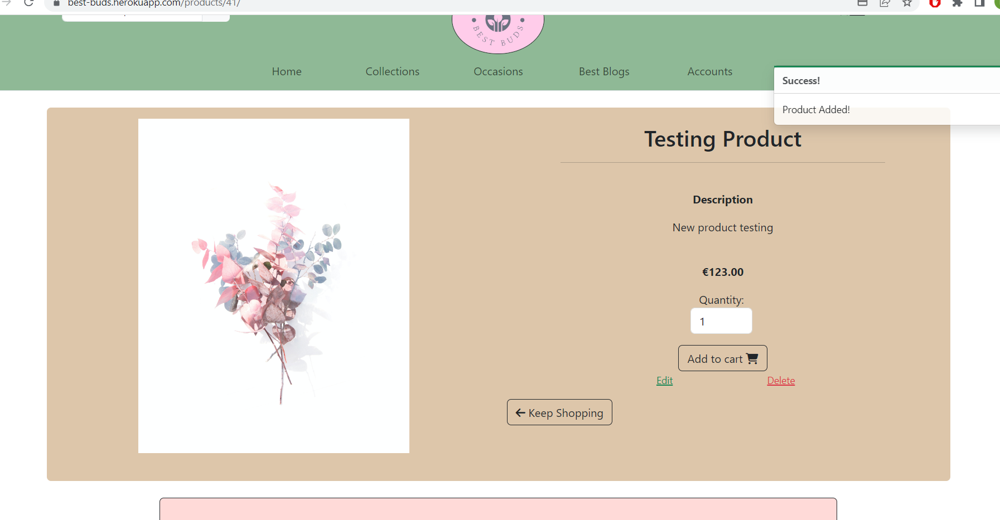

# **Best Buds**
Best buds is a fictional florist shop that specialises in bouquets and indoor plants. Located in Dublin, Ireland, Best Buds has a big focus on interacting with their consumer base. The website allows customers to make accounts that stores their information, which then also allows them to leave reviews on products. The website also has a blog section called 'Best Blogs' where they keep customers up to date on new products or even events the business might host. The blog allows customers to comment on posts and interact with each other, strenghtening their connection with their customers.

[Live Website](https://best-buds.herokuapp.com/)


# Contents

* [**Website Goals**](<#website-goals>)
    * [Target Audience](<#target-audience>)
    * [Brand Image](<#brand-image>)
    * [Facebook](<#facebook>)
* [**Project Management**](<#project-management>)
    *  [Trello](<#trello>)
* [**User Experience**](<#user-experience-ux>)
    *  [User Stories](<#user-stories>)
    *  [Wireframes](<#wireframes>)
    * [Design Choices](<#design-choices>)
* [**Features**](<#features>)
    * [Navbar](<#navbar>)
    * [Home Page](<#home-page>)
    * [Products](<#products>)
    * [Product Details](<#product-details>)
    * [Occasions](<#occasions>)
    * [Best Blogs](<#best-blogs>)
    * [My Account](<#my-account>)
    * [Django-allauth Features](<#django-allauth-features>)
    * [Add Product](<#add-product>)
    * [Login](<#login>)
    * [Cart](<#cart>)
    * [Checkout](<#checkout>)
    * [Order Confirmation](<#order-confirmation>)
    * [Footer](<#footer>)
    * [Toasts](<#toasts>)
* [**Future Features**](<#future-features>)
* [**Technologies Used**](<#technologies-used>)
    * [Languages](<#languages>)
    * [Frameworks & Software](<#frameworks--software>)
* [**Testing**](<#testing>)
    * [Testing User Stories](<#testing-user-stories>)
    * [Responsiveness](<#responsiveness>)
    * [Code Validation](<#code-validation>)
    * [Debugging](<#debugging>)
* [**Deployment**](<#deployment>)
    * [Heroku Deployment with AWS](<#heroku-deployment-with-aws>)
    * [Local Deployment](<#local-deployment>)
* [**Credits**](<#credits>)
    * [Contents](<#contents>)
    * [Media](<#media>)
* [**Acknowledgements**](<#acknowledgements>)

# Website Goals
## Target Audience

* While also offering services to those who need it for weddings/funerals, or offering valentines and birthday gift ideas, Best buds core target audience is aimed towards floral enthusiasts. This is reinforced with the blog section, where their customer community can directly interact with business and other customers.

## Brand Image

* Best buds brand image is that they are a website built by flower enthusiasts, for flower enthusiasts. Every part of this website has been designed to show that above all else, the business cares for it's product as much as it's customers.


## Facebook

* The social media presence for the website is fairly simple. Given more time, the business' social media advertising would be given much more attention as it is an extremely effect method of brand exposure.


# Project Management

## Trello

* For this project I have used Trello to manage my projects progress. I have found trello monumentally helpful for monitoring my projects development and ensuring user stories were fulfilled in an efficient manner.


# User Experience (UX)

## User Stories

### Viewing And Navigation
* As a site user I want to quickly see what products and services are available.
* As a site user I want to be able to click on a product to find out more information about it.
* As a site user I want to have access to the website through any device.
* As a site user I want to have access to all pages through the navbar.
* As a site user I want to be able to sort products in different ways(A-Z/By Price).
* As a site user I want to be able to search the whole store for products.
* As a site user I want to be able to view contact information for the business.

### Registration And User Accounts
* As a customer I want to be able to be able to easily register an account.
* As a customer I want to be able to store my information with my profile to make the checkout process quicker.
* As a customer I want to be able to view my order history.
* As a customer I want to be able to review products I've purchased. 
* As a customer I want to be able to interact with blog posts.


### Products and Purchasing
* As a customer I want visual confirmation when adding or removing from my cart.
* As a customer I want to be able to see how much is currently in my cart on any page.
* As a customer I want to be able to receive email confirmation that I have made an order.
* As a customer I want to clearly see a summary of my cart before checkout is complete to ensure the order details are correct.
* As a customer I want to see an order confirmation after checkout with all the orders details.

### Site Admin
* As a Site Admin I want to be able to create, read, update and delete products and blog posts. 
* As a Site Admin I want to be receive visual confirmation that I have created updated or deleted a product/post.
* As a Site Admin I want to be able to access the admin panel.
 

[Back to top](<#contents>)

## Wireframes

These wireframes were produced in [Figma](https://figma.com). I made frames for a full width display and then modeled for smaller screens once I had designed the full width diplay. The finished site varies slightly from the wireframes due to developments that occured during the creation process. I then scaled down the site and stacked content to fit it on smaller devices.


For smaller screens I created a second navbar that would replace the original. I did this as the original navbar looked very messy on smaller screens. In this navbar I replaced the business logo with an elegant font that is also used in the image carousel.


[Back to top](<#contents>)

## Design Choices

### Logo

I used [Logo](https://logo.com/) to create the Best Buds Logo. I really like the simple, legible design of it and it immediately grabbed me when I saw it.


### Colour Scheme

For the colour scheme of this website, I wanted to use a palette with earthy tones that complimented its products. After searching through many colour palettes I decided on this one. I used [Coolors](https://coolors.co/) to browse through the colour schemes. I decided on this palette as I felt it really complimented the Best Buds logo.


### Typography
 
For the typography of the website I decided to stay with the original bootstrap font for most of the page as it is aesthetically pleasing and very legible. I used [Dancing Script](https://fonts.google.com/specimen/Dancing+Script?query=dancing+script) from google fonts for the small navbar title and for the carousel heading as I thought it looked elegant and fit the vibe of the website. 


[Back to top](<#contents>)

# Features 

## Navbar

This website uses two navbars, one for large screens and another for smaller screens. Both navbars show the current carts total at all times. They both have links to all available pages on the website.


For smaller screens I created a second navbar that would replace the original. I did this as the original navbar looked very messy on smaller screens. In this navbar I replaced the business logo with an elegant font that is also used in the image carousel.


## Home Page

The first thing that appears under the navbar on the home screen is a carousel(on small screens a div) that welcomes users to the site and lets users know that delivery on orders over 30 euro is free. This has a link to the products page directly below this to entice customers to view their products.


The second slide on the carousel points towards the Indoor Plants section with a corresponding link.


This is followed by a Collections section, showing the different cateogies that the business specialises in.


The last piece of content on the home page is the About Us section, which documents the business and its morales.


## Products

The products page displays a list of all the products unless a user has searched or sorted for a certain type of product. The product card host basic information on each product such as a products image, name, price and what type of product it is.
There is a dropdown button at the top of the page, giving users an option to sort the way products are displayed in a variety of different ways.
If the user is logged in as an admin, small links appear on each card allowing them to edit or delete products.


## Product details

This page displays all the information available about a product from the image and price to the description. The user can add the product to their cart from here aswell.


If the user adds an item to their cart, they receive a toast notification to confirm it has been added with a summary on the item they have added, as well as their carts current total and a link to view their cart.


Below the product details section is a review section, where logged in users can review products they have bought and document their experience. 


Below this shows all the previous reviews for that product and allows customers to delete reviews that they have left. After a review has been submitted, the customer also receives visual confirmation that they have posted a review.


## Occasions

This page details the business ability to cater for different events. The wedding section describes how excited and passionate the business is about catering for weddings, while the funerals page shows that the business handles funerals with professionalism and understanding.


## Best Blogs

The Best Blogs section allows customers to keep up to date with the business and directly interact with blog posts. A button appears at the top of the page for admins to add posts. Each post displayed here has the posts title, intro and date posted, if the user wants to read more they just have to click into the post.


Upon clicking into the post, the user can now see all the posts information. Underneath this, logged in customers are encouraged to leave a comment. Admin users can also delete posts from here.


Underneath the comment form is a list of all the comments for that post with information like when it was posted and by who. After a comment is posted, a toast pops up to tell the user their comment was successful.


Admins have access to the Add a blog post page. To create a post they only have to enter a title, intro and the body of the blog. This is then met with a toast confirmation. 


## My Account

Users can customise their delivery information to make checking out quicker. From this page they can also access any previous orders they have made and view any order history information.


## Django-allauth Features
For all login and registration features on this website, [djgano-allauth](https://django-allauth.readthedocs.io/en/latest/) was used.
- Sign Up: The users will be asked to fill out `E-mail`, `User Name` and `Password` to create an account. When the sign up form is submitted, a verification email will be sent to the user's email address to complete the sign up process.
- Log In: Users will be asked to input `User Name` or `Email`, and `Password` to login. If the user successfully logged in, a success message will pop up and redirect to the landing page.
- Log out: Log out page is accessible from the site menu. After the user successfully signed out button on the sign out page, a success message will appear and redirect to the landing page.
- Forgot password: Forgot password page is accessible from Sign In page. Users will be asked to put in an email address which they have used for their registration to the site. An email with a link to reset the password will be sent after submitting the form.

## Add Product

Admin user are able to add products from this page. They fill out a form with of all the products information, then they receive a toast to confirm its been added to the online store and be redirected to the new products page.




## Login

I used django allauth for all user account and registration. All allauth templates have been styled in the same way with the flower heart image adjascent to whichever allauth form is currently in use.


## Cart

The users cart displays all the items they have added and gives users the option to update the quantity or remove an item from their bag entirely. At the bottom of this page the user can see a breakdown of their total and whether or not they have reached the free delivery amount. If they have not, there is a prompt letting them know how much more they need to spend.
Underneath this, there is a button that will take them to the checkout page.


If their cart is empty, there will be a button to the products page, incentivising them to add products to their cart.


## Checkout

On the checkout page, the user must now enter all their delivery and payment details and they are given the option if they want their delivery information saved. Next to this is another summary of their current cart. 
Below their payment information is a 'Complete Order' button where the amount the user will be charged is also displayed. Once this button is clicked, [Stripe](https://stripe.com/ie) then handle the payment and the user is brought to an order confirmation page.


## Order Confirmation

Upon completing an order, a user is brought to the order confirmation page where they can see all their order details from a recap of their order to all their delivery details. They also receive a message informing them that they will receive a confirmation email and a toast notification will appear with the order number.


## Footer

The footer for this website has been kept very basic, storing only the link to their facebook account and contact information 


## Toasts

Toasts have been used throughout this website as a way of informing both the admin and the user of their actions. From confirming a user has added a product to their cart, to letting an admin know that they have successfully deleted a product, toasts have been a fundamental part of the user experience.


[Back to top](<#contents>)

# Future Features

* Currently, any user who is logged in is able to review a product, whether they have purchsed it or not. In future versions of this project I aim to limit reviews to people who have actually purchased the product.

* Allow admins to make draft blog posts that they can save and come back to before posting.

* Allow admins to edit blog posts without having to delete the original and rewrite each post. I was not able to implement this feature due to time contraints.

* Have a page where admins are able to monitor how many users they have, how many orders are being made daily and gives them notifications when users leave a review or blog comment. 

* Allow users to delete/edit comments on posts. Again, this feature was not implemented due to time contraints with the project deadline.

* Display the average rating of the product on the product details page.

* Allow customers to track their order.

* Allow users to refine their product sorting even more. At the moment they can only sort products with a single filter(by price or by type) but ideally they would be able to sort by price while also filtering by type of product.

* Allow users to add profile pictures, to add an extra level of personalisation to the users website experience. 

[Back to top](<#contents>)

# Technologies Used

## Languages

* [Python](https://en.wikipedia.org/wiki/Python_(programming_language)) - Provides the functionality for the site.
* [HTML5](https://en.wikipedia.org/wiki/HTML) - Provides the frontend content and structure for the website.
* [CSS3](https://en.wikipedia.org/wiki/CSS) - Provides the all stylings throughout the website.
* [JavaScript](https://en.wikipedia.org/wiki/JavaScript) - Provides interactive elements of the website

## Frameworks & Software
* [Bootstrap](https://getbootstrap.com/) - A CSS framework that helps building solid, responsive, mobile-first sites
* [Django](https://www.djangoproject.com/) - A model-view-template Python framework used to throughout site
* [Figma](https://figma.com/) - Used to create the wireframe.
* [Git](https://git-scm.com/) - Used for version control
* [Github](https://github.com/) - Used to host and edit the website.
* [Heroku](https://en.wikipedia.org/wiki/Heroku) - A cloud platform that the application is deployed to.
* [Lighthouse](https://developer.chrome.com/docs/lighthouse/overview/) - Used to test performance of site.
* [Favicon](https://favicon.io/) - Used to create the favicon.
* [VSCode](https://code.visualstudio.com/) - Used for writing all the websites code.
* [Google Chrome DevTools](https://developer.chrome.com/docs/devtools/) - Used to debug and test responsiveness.
* [Trello](https://trello.com/en-GB) - A project management tool to organize the project.
* [Amazon Web Services](https://aws.amazon.com/) - A service that hosts all static files and images in the project.
* [PostgreSQL](https://www.postgresql.org/) - Database used for production
* [ElephantSQL](https://www.elephantsql.com/) - A PostgreSQL database hosting service.
* [HTML Validation](https://validator.w3.org/) - Used to validate HTML code
* [CSS Validation](https://jigsaw.w3.org/css-validator/) - Used to validate CSS code
* [Stripe](https://stripe.com/ie) - Used for all the websites payment functionality

[Back to top](<#contents>)

# Models

## Accounts

* For the model in my accounts app, I have UserProfile. This model is used for storing all users and their delivery information together.


* In my blog app I have 2 models, BlogPost and Comments.

The BlogPost model is used for posts that the business makes to their blog. The admin enters a title, intro, and body and the date and time it is made is recorded. The slug is used as a way of identifying posts from one another, so when the admin creates a post, a new and unique slug is made for that specific post.


The Comments model is used for a user leaving a comment on a post. This model is directly connected to the BlogPost model by using the 'post' field as a foreign key. The 'user' field references the current user who is leaving the comment and the body field is the actual content the user inputs. The date and time the comment is made is also recorded.


* In the checkout app, 2 models are used. The Order model and the OrderLineItem model.

The Order model represents all information on about an order, from all the users delivery information and order number to purchase information and delivery cost. The 'user' field references the UserProfile as a foreign key. 


The OrderLineItem represents each item in the users cart when checking out. The Order model is refernced as a foreign key, as is the product which refernces the Product model from the products app. This model also includes the quantity of the product and the line item total as a decimal field.


* In the Products app there are 2 models, the Product app and ReviewRating app.

The Product model represents the products available on the store. The sku is how each item is identified while all the other fields such as name, description, image, price, and type are information about the physical product itself. 


Lastly, the ReviewRating model is used for when a customer leaves a review. It refernces the product that the review is being left about through the 'product' foreign key field, and the 'user' field points to the user that is currently logged in. The title, review and rating is then the actual content of the review.


# Testing

## Testing User Stories

### Viewing And Navigation

* As a site user I want to quickly see what products and services are available.

    * There is a link to view all products and product types from the navbar as well as a link to the occassions page which has information about the business' catering.
     
* As a site user I want to be able to click on a product to find out more information about it.

    * Clicking on product card from the products page directs the user to the products detail page which has all product information.

* As a site user I want to have access to the website through any device.

    * Website is [responsive](<#responsiveness>) on all screen sizes and browsers.

* As a site user I want to have access to all pages through the navbar.

    * Navigation links for each page are available through the navbar

* As a site user I want to be able to sort products in different ways(A-Z/By Price).

    * At the top of the products page there is a Sort By dropdown button which has a variety of ways site users can sort products.

* As a site user I want to be able to search the whole store for products.

    * In the navbar there is a search form. This form does not only check if the searched words are in the title, but also if they appear in the description.

* As a site user I want to be able to view contact information for the business.

    * Contact information for the business is available in the footer.

### Registration And User Accounts

* As a customer I want to be able to be able to easily register an account.

    * A navigation link to the registration page can be found under the Accounts dropdown.

* As a customer I want to be able to store my information with my profile to make the checkout process quicker.

    * Logged in customers can either update their delivery information from their account page, or click the 'Save my Information' button from the checkout page.

* As a customer I want to be able to view my order history.

    * Customer can see their whole order history from their Account page, as well as click into each order for all available information regarding that order.

* As a customer I want to be able to review products I've purchased. 

    * Logged in customers can leave reviews on products by going to the details page of that product and filling out the review form below the products information section.

* As a customer I want to be able to interact with blog posts.

    * Logged in customers are able to leave comments below blog posts by clicking into the blog posts page and filling out the comment section below the post.

### Products and Purchasing

* As a customer I want visual confirmation when adding or removing from my cart.

    * Upon adding, removing or changing the an item's quantity, the customer receives a toast pop up to confirm their action.

* As a customer I want to be able to see how much is currently in my cart on any page.

    * On any screen size, a cart icon with the current total of the customers cart is available at the navbar at all times.

* As a customer I want to be able to receive email confirmation that I have made an order.

    * Upon completing an order, the customer is brought to a checkout success page where a message will appear, confirming that they will receive email confirmation. They will shortly after receive a personalised message with all the orders information.

* As a customer I want to clearly see a summary of my cart before checkout is complete to ensure the order details are correct.

    * A summary of the customers cart(all items names, quantities, the cart's subtotal and delivery cost) appears on the cart page, the checkout page and then again once the order has been completed on the checkout success page.

* As a customer I want to see an order confirmation after checkout with all the orders details.

    * Once an order has been placed, the user will be brought to the checkout success page where they will receive both a summary of the orders details, a message stating they will receive email confirmation, and also a toast pop up of the order number.

* As a Site Admin I want to be able to create, read, update and delete products and blog posts. 

    * Site admins are able to create, read update and delete products with ease either through the Add Product link on the navbar or the products page. They will also receive a pop up message asking them to confirm they want to delete something.

    * Unfortunately admins are only able to create read or delete blog posts at the moment as editing blog posts functionality has yet to be added.

* As a Site Admin I want to be receive visual confirmation that I have created updated or deleted a product/post.

    * Upon creating, updating or deleting a product/post, the admin will receive a toast with a message confirming their actions.

* As a Site Admin I want to be able to access the admin panel.

    * Site users that are logged in have access to the admin panel through the URL.


## Responsiveness
The website is responsive accross all screen sizes. On small screen sizes the images and content stack ontop each other. The website was tested on the following browsers with no visible issues for the user. Google Chrome, Microsoft Edge and Mozilla Firefox.

The responsive design tests were carried out manually with [Google Chrome DevTools](https://developer.chrome.com/docs/devtools/).

|        | Moto G4 | Galaxy S5 | iPhone 5 | iPad | Display <1200px | Display >1200px |
|--------|---------|-----------|----------|------|-----------------|-----------------|
| Render | pass    | pass      | pass     | pass | pass            | pass            |
| Images | pass    | pass      | pass     | pass | pass            | pass            |
| Links  | pass    | pass      | pass     | pass | pass            | pass            |

## Code Validation

HTML validation was done through [W3C HTML Validator](https://validator.w3.org/nu/)

At first there were a number of errors but upon fixing these, the website passed everything


CSS validation was done through [W3C CSS Validator](https://jigsaw.w3.org/css-validator/)


Chromes [Lighthouse](https://developer.chrome.com/docs/lighthouse/overview/) was used to test this websites performance


## Debugging

While trying to deploy my project I ran into this error when I tried to load my fixtures to elephantSQL. I would get the error "UnicodeDecodeError: 'utf-8' codec can't decode byte 0xff in position 0: invalid start byte".
After much research into this topic which I didn't understand very well, I found [this video](https://www.youtube.com/watch?v=GkKHCL3Ngyk). The video detailes that to stop this error, you must go into the json.py file where the terminal states there is an error and add "UTF-16" to the Deserializer function.

Another problem I was faced in this websites production was this. While coding the review section of the website, everything was working smoothly on my local server. When I would commit, push and then test it on heroku however, I would get this error message.


After researching the problem I was having I found the issue was that I had not synced my databases and need to run 'git push heroku' aswell.
I found the solution on this [Stack Overflow thread](https://stackoverflow.com/questions/38134535/django-on-heroku-relation-does-not-exist)

Another problem I faced was images not rendering when I first deployed my site to heroku. The MEDIA_URL was being completely bypassed for the image and I couldnt figure out why. The source of this problem was being cause because I had forgotten to add context_proccesors.py. 


[Back to top](<#contents>)

# Deployment
## Heroku Deployment with AWS
This website is deployed on [Heroku](https://www.heroku.com/), following these steps:
1. Install these packages to your local environment, since these packages are required to deploy a Django project on Heroku.
- [gnicorn](https://gunicorn.org/): `gnicorn` is Python WSGI(web server gataway interface) server for UNIX.
- [psycopg2-binary](https://pypi.org/project/psycopg2-binary/): `psycopg2-binary` is PostgreSQL database adapter for the Python programming language.
- [dj-database-url](https://pypi.org/project/dj-database-url/): `dj-database-url` allows you to utilize the 12factor inspired DATABASE_URL environment variable to configure your Django application.
2. Create a `requirements.txt` file and freeze all the modules with the command `pip freeze > requirements.txt` in the terminal.
3. Create a `Procfile` write `web: gunicorn <app_name>.wsgi:application` in the file.
4. `git add` and `git commit` and `git push` all the changes to the Github repository of this project.
5. Go to Heroku and create a **new app**. Set a name for this app and select the closest region (Europe) and click **Create app**.
6. Go to **Resources** tab in Heroku, then in the **Add-ons** search bar look for **Heorku Postgres**(you can type postgres), select **Hobby Dev — Free** and click **Submit Order Form** button to add it to your project.
7. In the heroku dashboard for the application, click on **Setting** > **Reveal Config Vars** and set the values as follows:

| Key | Value |
| ----------- | ----------- |
| AWS_ACCESS_KEY_ID | `Your AWS Access Key` |
| AWS_SECRET_ACCESS_KEY | `Your AWS Secret Access Key` |
| DATABASE_URL | `Your Postgres Database URL` |
| EMAIL_HOST_PASS | `Your Email Password (generated by Gmail)` |
| EMAIL_HOST_USER | `Your Email Address` |
| SECRET_KEY | `Your Secret Key` |
| STRIPE_PUBLIC_KEY | `Your Stripe Public Key` |
| STRIPE_SECRET_KEY | `Your Stripe Secret Key` | 
| STRIPE_WH_SECRET | `Your Stripe WH Key` |
| USE_AWS | `True` |

* I used [Mini Web Tool](https://miniwebtool.com/django-secret-key-generator/) to generate Django Secret Key.

8. Comment out the current database setting in settings.py, and add the code below instead. This is done temporarily to migrate the datbase on Heroku.
```
  DATABASES = {     
        'default': dj_database_url.parse("<your Postrgres database URL here>")     
    }
```
9. Migrate the database models to the Postgres database using the following commands in the terminal:
`python3 manage.py migrate`
10. Load the data fixtures into the Postgres database using the following command:
`python3 manage.py loaddata <fixture_name>`
11. Create a superuser for the Postgres database by running the following command:
`python3 manage.py createsuperuser <superuser_name>`
12. Replace the database setting with the code below, so that the right database is used depending on development/deployed environment.
```
if 'DATABASE_URL' in os.environ:
    DATABASES = {
        'default': dj_database_url.parse(os.environ.get('DATABASE_URL'))
    }
else:
    DATABASES = {
        'default': {
            'ENGINE': 'django.db.backends.sqlite3',
            'NAME': os.path.join(BASE_DIR, 'db.sqlite3'),
        }
    }
```
13. Disable collect static, so that Heroku won't try to collect static file with: `heroku config:set DISABLE_COLLECTSTATIC=1`
14. Add `'best-buds.herokuapp.com', 'localhost', '127.0.0.1'` to `ALLOWED_HOSTS` in settings.py.
```
ALLOWED_HOSTS = ['best-buds.herokuapp.com', 'localhost', '127.0.0.1']
```
15. In Stripe, add Heroku app URL a new webhook endpoint.
16. Update the settings.py with the new Stripe environment variables and email settings.
17. Commit all the changes to Heroku. Medial files are not connected to the app yet but the app should be working on Heroku.

### Amazon Web Service S3
The static files and media files for this deployed site are hosted in the [AWS](https://aws.amazon.com/) S3 Bucket. You will need to create S3 bucket, complete the setting up and upload static files and media files to the S3 bucket. You can find [Amazon S3 documentation](https://docs.aws.amazon.com/AmazonS3/latest/gsg/CreatingABucket.html) for more information on the setting.
I used CORS configuration below:
```
[
  {
      "AllowedHeaders": [
          "Authorization"
      ],
      "AllowedMethods": [
          "GET"
      ],
      "AllowedOrigins": [
          "*"
      ],
      "ExposeHeaders": []
  }
]
```

- Setting for static/media files in settings.py
1. Install `boto3` and `django-storages` with a command `pip install boto3` and `pip install django-storages` in your terminal, to connect AWS S3 bucket to Django.
2. Add 'storages' to `INSTALLED_APPS` in settings.py.
3. Add the following in settings.py.
```
if 'USE_AWS' in os.environ:
    AWS_S3_OBJECT_PARAMETERS = {
        'Expires': 'Thu, 31 Dec 2099 20:00:00 GMT',
        'CacheControl': 'max-age=94608000',
    }
    AWS_STORAGE_BUCKET_NAME = 'best-buds'
    AWS_S3_REGION_NAME = 'eu-west-1'
    AWS_ACCESS_KEY_ID = os.environ.get('AWS_ACCESS_KEY_ID')
    AWS_SECRET_ACCESS_KEY = os.environ.get('AWS_SECRET_ACCESS_KEY')
    AWS_S3_CUSTOM_DOMAIN = f'{AWS_STORAGE_BUCKET_NAME}.s3.amazonaws.com'

    STATICFILES_STORAGE = 'custom_storages.StaticStorage'
    STATICFILES_LOCATION = 'static'
    DEFAULT_FILE_STORAGE = 'custom_storages.MediaStorage'
    MEDIAFILES_LOCATION = 'media'

    STATIC_URL = f'https://{AWS_S3_CUSTOM_DOMAIN}/{STATICFILES_LOCATION}/'
    MEDIA_URL = f'https://{AWS_S3_CUSTOM_DOMAIN}/{MEDIAFILES_LOCATION}/'
```
5. Add custom_storages.py
6. Delete DISABLE_COLLECTSTATIC from Heroku Config Var.
7. Push all the changes to Github/Heroku and all the static files will be uploaded to S3 bucket.
By setting up above, Heroku will run python manage.py collectstatic during the build process and look for static and media files.

### Automatic Deploy on Heroku
You can enable automatic deploy in the following steps that pushes update to Heroku everytime you push to github.
1. Go to Deploy in Heroku dashboard.
2. At `Automatic deploys`, choose a github repository you want to deploy.
3. Click `Enable Automatic Deploys`.


## Local Deployment
For local deployment, you need to have an IDE (I used Gitpod for this project) and you need to install the following:
- Git, Python3, PIP3
Also, you need to create account in the following services if you don't own yet:
- Stripe, AWS (S3 bucket), Gmail

1. In the IDE you are using, copy and paste the following commane into the terminal to clone this repository.
    `git clone https://github.com/Gallie83/Best-Buds-Florist.git`
(the other ways to clone a repository are written in this [GitHub documentation](https://docs.github.com/en/free-pro-team@latest/github/creating-cloning-and-archiving-repositories/cloning-a-repository))
2. Set up environment variable in your selected IDE, or you can create `.env` file in your root directory and add `.env` to `.gitignore` file, and add the followings to the `.env` file.
```
import os  
os.environ["DEVELOPMENT"] = "True"    
os.environ["SECRET_KEY"] = "<Your Secret Key>"
os.environ["STRIPE_PUBLIC_KEY"] = "<Your Stripe Public Key>"    
os.environ["STRIPE_SECRET_KEY"] = "<Your Stripe Secret Key>"    
os.environ["STRIPE_WH_SECRET"] = "<Your Stripe WH Secret Key>"    
```
3. Install all the required packages with `pip install -r requirements.txt`
4. Migrate the models to crete a database using in your IDE with `python manage.py makemigrations` and `python manage.py migrate`
5. Load the data fixtures into the database using the following command:
`python manage.py loaddata <fixture_name>`
6. Create a superuser for the Postgres database by running with `python manage.py createsuperuser`
7. Now you can access the app using the command `python manage.py runserver`

[Back to top](<#contents>)

# Credits
## Content

* The font used came from [Google Fonts](https://fonts.google.com/).
* All code, except where otherwise specified, was written by me - Kevin Gallagher.
* The name for the website came from my girlfriend - Lisa.

## Media
* All images came from [Unsplash](https://unsplash.com/).
* The Logo for the business came from [Logo](https://logo.com/)
[Back to top](<#contents>)

# Acknowledgements
The site was completed as a Portfolio 5 Project piece for the Full Stack Software Developer Diploma at [Code Institute](https://codeinstitute.net/). I would like to thank my mentor [Precious Ijege](https://www.linkedin.com/in/precious-ijege-908a00168/), the Slack community, and all at Code Institute for their help and support. 

Kevin Gallagher 2023.

[Back to top](<#contents>)